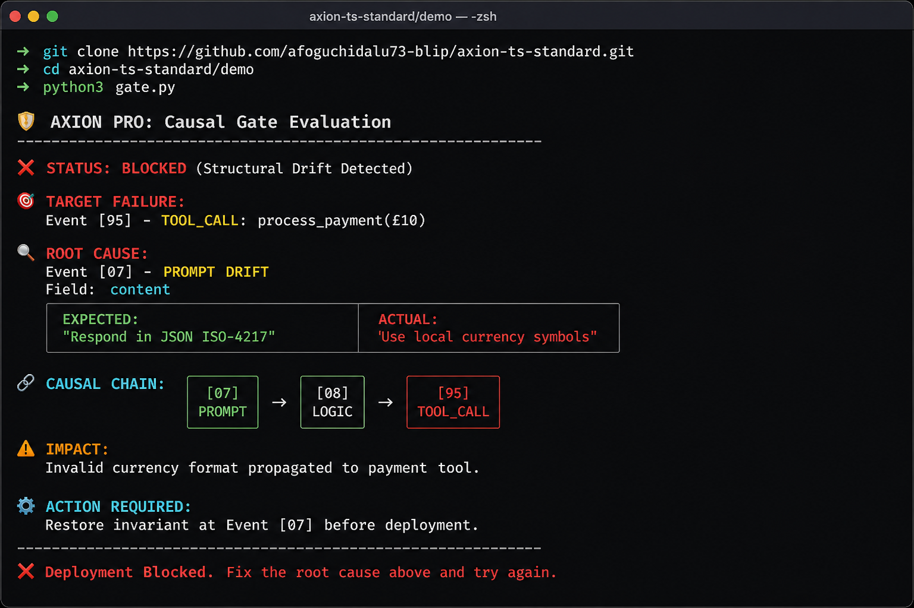

# AXION-TS Standard (v1.2.0)

The official open-source data standard for **Causal Trace Mapping** and **Deterministic AI Forensic Auditing**. 

Built to satisfy **Article 12 of the EU AI Act**, AXION-TS provides a mathematical framework for isolating root causes in complex multi-agent swarms.

---

## ⚡ 1-Minute Demo: Causal Enforcement

See AXION Pro block a broken deployment and identify the root cause in seconds.

### The Scenario
A system prompt is modified (Step 07). This causes a silent logic drift that eventually crashes a payment tool call (Step 95). AXION traces the failure back to the original prompt change.

### Run it now:
```bash
git clone https://github.com/afoguchidalu73-blip/axion-ts-standard.git
cd axion-ts-standard/demo
python gate.py
```

### The Evidence
AXION identifies the exact drift that caused the downstream tool failure:



> *"AXION reduced our debugging time from hours to seconds by identifying exactly which prompt change broke our tool outputs."*

---

## 💎 AXION Pro — The Production Safety Layer

AXION Lite finds problems. **AXION Pro stops them from shipping.**

### Core Features:
* 🔒 **Causal Gate (CI/CD Enforcement):** Automatically block deployments if structural drift is detected.
* 📊 **Drift Intelligence:** Analyze hundreds of runs to find recurring root causes.
* 🧾 **Automated Incident Reports:** Human-readable summaries ready for Jira or Slack.

### Pricing & Licensing
The **AXION Enterprise Kernel** is available for commercial licensing and technical transfer.

**For inquiries, contact:**
📩 **afoguchidalu73@gmail.com**
---

## 🚀 Enterprise Integration

AXION Pro is designed to be a **Deployment Gate**. To protect your production environment from AI drift, add this step to your `.github/workflows/ci.yml`:

```yaml
- name: AXION Causal Gate
  uses: afoguchidalu73-blip/axion-ts-standard@main
  with:
    current_trace: 'path/to/current_trace.json'
    gold_standard: 'path/to/gold_standard.json'
    target_id: '95'
